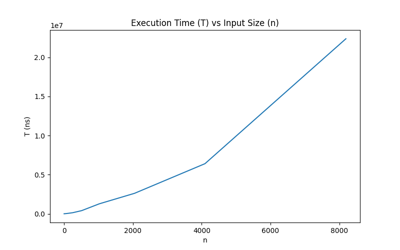

# Programming Assignment 1: Matching and Verifying
## Authors
**Herique Batista e Silva** (UFID: 24431968)  
**Bora Turkmen** (UFID: 25221169)  
## Instructions
1. **Prerequisites**
    - Ensure you have CMake >= 3.26 installed
    - Ensure you have a C++17 compiler
    - Ensure you have a Python interpreter
    - Ensure you have Python's pandas library intalled
    - Ensure you have Python's matplotlib library installed
2. **Clone Project**  
    ```bash
    git clone https://github.com/ricks05/COP4533_PA1.git
3. **Create a Build Directory**  
   ```bash
   mkdir build
   cd build
4. **Generate Build System**  
   ```bash
   cmake ..
5. **Build the Project**  
   ```bash
   cmake --build .
6. **Run Program**  
   From the build directory:
   ```bash
   ./app
   ```
   - Using the console, provide your input (following assignment format)  
   - This will run parts A and B and display respective outputs (following assignment formats) 
8. **Analyze Program**  
   From the build directory:  
   ```bash
   ./test
   ```
    Then run the python file:
   ```bash
   python ../test/graph.py
   ```
   - This will run Part C with randomly generated inputs satisfying a range n values
## Part C
  
From the graph, it is clear that our matching engine presents non-linear growth.  
It presents polynomial growth that is likely quadratic, making it so that T(n) belongs to O(n^2).
